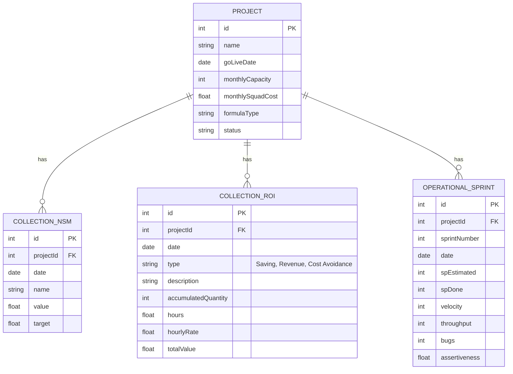

# Arquitetura do Sistema: MetricOS

## 1. Arquitetura Geral
O sistema foi construído utilizando uma arquitetura **Full-Stack (Client-Server)**:
- **Frontend:** React 19 + Vite + Tailwind CSS + Recharts + React Router.
- **Backend:** Node.js + Express + Supabase SDK.
- **Banco de Dados:** Supabase (PostgreSQL).

A aplicação é servida de forma unificada: durante o desenvolvimento, o Vite atua como middleware do Express. Em produção, o Express serve os arquivos estáticos do React e expõe a API REST no mesmo domínio.

## 2. Estrutura de Pastas Recomendada
```
/
├── server/                   # Código do Backend (Node.js + Express)
│   ├── supabase.ts           # Configuração do Supabase Client
│   ├── routes.ts             # Endpoints REST da API
│   └── services/             # Serviços de negócio (cálculo de ROI, etc)
│       └── roi.service.ts
├── src/                      # Código do Frontend (React)
│   ├── components/           # Componentes reutilizáveis (Layout, Sidebar, Topbar)
│   ├── pages/                # Páginas da aplicação (Dashboard, Projects, etc)
│   ├── store/                # Gerenciamento de estado (Context API / Zustand)
│   ├── App.tsx               # Configuração de Rotas
│   └── index.css             # Estilos globais e variáveis Tailwind
├── docs/                     # Documentação e diagramas
├── server.ts                 # Ponto de entrada principal (Express + Vite)
└── package.json              # Dependências e scripts
```

## 3. Diagrama ERD (Entity-Relationship Diagram)


## 4. Endpoints REST Implementados
- `GET /api/projects` - Retorna todos os projetos com suas respectivas coletas (NSM, ROI e Sprints).
- `POST /api/projects` - Cria um novo projeto.
- `POST /api/collections/roi` - Registra uma nova coleta financeira (Saving, Revenue, Cost Avoidance).
- `POST /api/collections/nsm` - Registra uma nova coleta de North Star Metric.

*(Endpoints adicionais para atualização, deleção e métricas estratégicas podem ser adicionados seguindo o mesmo padrão no arquivo `routes.ts`)*

## 5. Serviços e Fórmulas
A lógica de cálculo de ROI foi abstraída para permitir que cada projeto tenha sua própria fórmula. O backend pode calcular o ROI dinamicamente somando os valores de `CollectionROI` e subtraindo o custo calculado com base nos `OperationalSprint` e `Project.monthlySquadCost`.

## 6. Sugestões de Melhorias Futuras
1. **Autenticação e Autorização:** Implementar JWT com níveis de acesso (Admin, Visualizador, Editor).
2. **Integração GraphQL:** Adicionar Apollo Server no Express para permitir consultas mais flexíveis pelo frontend.
3. **Jobs Assíncronos (Cron):** Utilizar `node-cron` para consolidar métricas no final de cada mês automaticamente.
4. **Exportação de Dados:** Implementar geração de relatórios em PDF/Excel utilizando bibliotecas como `exceljs` ou `pdfkit`.
5. **Webhooks:** Criar webhooks para integração com n8n, Power BI ou Slack para alertas de metas atingidas.
